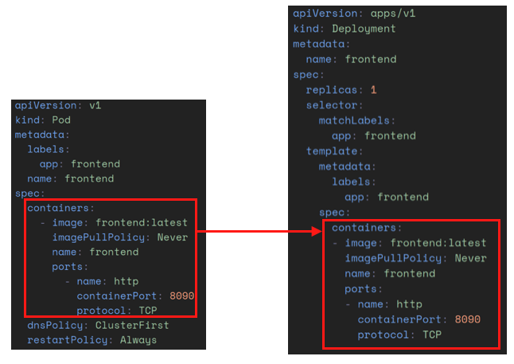
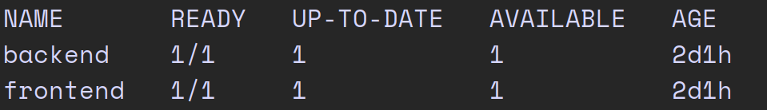
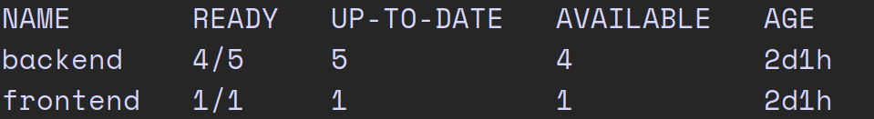
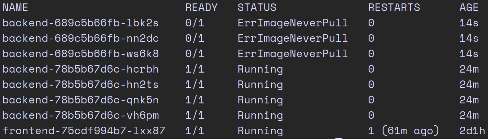
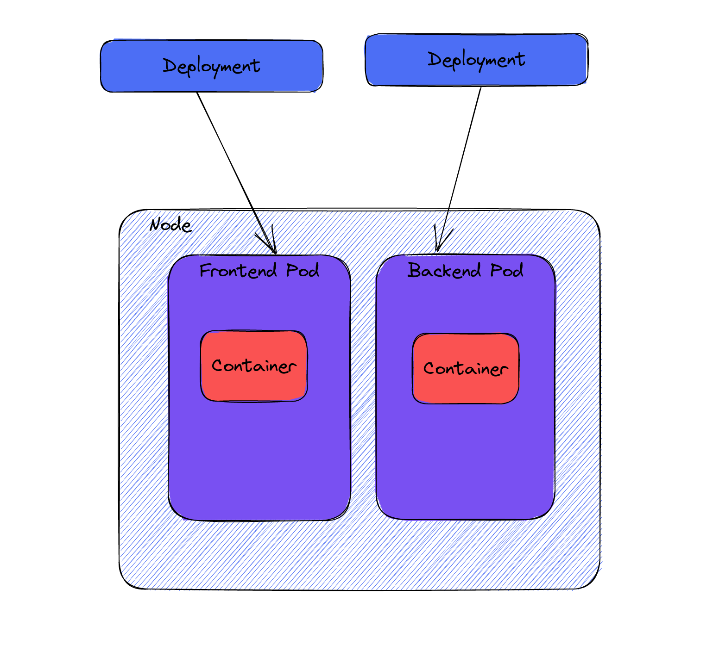

# From ZERO to CKAD
In dieser Blogserie wollen wir unseren Weg von Grundauf bis zum CKAD aufzeigen und möglichst viel aus dem 
Material zur Vorbereitung zum CKAD anhand eines praktischen Beispiels erklären. Das Repository zum Mitmachen findet ihr 
.
Die fertigen yamls für das Deployment findet ihr im Branch `deployment`


## Was ist ein Deployment?
Deployments sind eine Ressource zur Verwaltung von Pods. Mit Deployments können wir Pods anpassen und im 
laufenden Betrieb aktualisieren und bei Problemen wieder zurückrollen, ohne Ausfallzeiten zu haben.

Das klingt doch gut, dann auf zum ersten Deployment. Wir lassen uns wieder eine yaml, die ein Deployment 
beschreibt, generieren.

Mit `k create deployment frontend --image=nginx --dry-run=client -o yaml > deploy.yaml` wird das ganze wieder in
die deploy.yaml geschrieben und wir werfen zur Übersicht die Zeilen raus, die wir nicht brauchen.

```yaml
apiVersion: apps/v1
kind: Deployment
metadata:
  labels:
    app: frontend
  name: frontend
spec:
  replicas: 1
  selector:
    matchLabels:
      app: frontend
  template:
    metadata:
      labels:
        app: frontend
    spec:
      containers:
      - image: frontend
        name: frontend
```

Sieht ja fast aus wie die yaml für Pods. Generell gilt auch für die meisten yamls in Kubernetes, dass sie die 
folgenden Keys haben:
- apiVersion
- kind
- metadata
- spec

In der Metadata verstecken sich die labels für das Deployment. Labels sind ein Key-Value-Paar um Deployments,
Pods und Services zu gruppieren und danach filtern zu können. Unter der Metadata lässt sich auch der Name des 
Deployments finden.

Kommen wir nun zum spannenden Teil, den specs. Gleich das erste was uns auffällt sind die replicas. Sie zeigen 
an, wieviele Pods in dem Deployment gewünscht sind.

Der Selector hat die `matchLabels`, die wieder ein Key-Value-Paar halten. Das Deployment überwacht also alle
Pods mit dem Label Paar `app: frontend`. Ändert sich also ein Pod mit diesem Paar, sei es von der Konfiguration
oder sollte er sterben, fährt das Deployment wieder genügend Pods hoch und runter, bis der "desired state",
den wir in den replicas definiert haben wieder erreicht ist. Bei einem Update der Pods werden also nacheinander 
ein Pod mit der neuen Konfiguration gestartet und bei Erfolg ein alter Pod herunter gefahren, bis alle Pods den
neuen Zustand erreicht haben.

Das Template beschreibt die Pods die wir in dem Deployment verwenden. Sie haben wieder die labels `app: frontend` 
damit das Deployment sie finden kann. in der `spec` werden die Container, die in den Pods laufen, beschrieben.
Also passen wir diesen für unsere Applikation an.

```yaml
apiVersion: apps/v1
kind: Deployment
metadata:
  name: frontend
spec:
  replicas: 1
  selector:
    matchLabels:
      app: frontend
  template:
    metadata:
      labels:
        app: frontend
    spec:
      containers:
      - image: frontend:latest
        imagePullPolicy: Never
        name: frontend
        ports:
        - name: http
          containerPort: 8090
          protocol: TCP
```

Die `containers` im Deployment sind das gleiche wie in der `pod.yaml`, die wir im Kapitel der Pods angelegt 
haben.



Überprüfen wir mal, ob das Deployment erfolgreich war. Mit `kubectl get deploy` wird uns das Deployment 
angezeigt.



Wir können sehen, dass jeweils für Frontend und Backend 1 Pod läuft.

Brauchen wir mehr Pods, weil z.B. viele Requests das Backend ans Limit bringen, können wir die `replicas` erhöhen 
und es werden neu Pods hochgefahren, bis der gewünschte State erreicht ist.

```yaml
apiVersion: apps/v1
kind: Deployment
metadata:
  labels:
    app: backend
  name:  backend 
spec:
  replicas: 5
  selector:
    matchLabels:
      app: backend 
  template:
    metadata:
      labels:
        app: backend 
    spec:
      containers:
      - image: backend:latest
        imagePullPolicy: Never
        name: backend
        ports:
        - name: http
          containerPort: 8089
          protocol: TCP
```

Alternativ kann man auch mit `kubectl scale deployment backend --replicas=5` die Anzahl der Replicas ändern.



Wenn wir nun das Image ändern, z.B. zu `busybox`, werden die Pods nicht hochfahren können. Da Kubernetes die 
Updates der Pods inkrementell macht, ist das nicht weiter schlimm, wie wir hier sehen.



Es werden zwar 3 Pods versucht hoch zu fahren, doch erst wenn diese in den Ready State kommen, werden die alten
heruntergefahren. Um diesen Fehler schnell wieder auszubügeln kann man mit `kubectl rollout undo deployment
backend` auf den vorherigen Stand zurück rollen. Falls man zu einer bestimmten Version zurück möchte,
kann man sich mit `kubectl rollout history deployment backend` die Deployment-History anzeigen lassen,
um dann mit `kubectl rollout undo deployment backend --to-revision=2` das gewünschte Deployment anzuwenden.

Um die Applikation über den Browser via localhost zu erreichen müssen wir aber wieder ein port-forward machen.
Helfen uns da vielleicht die Services weiter?



