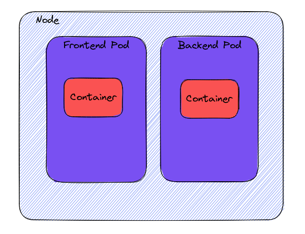
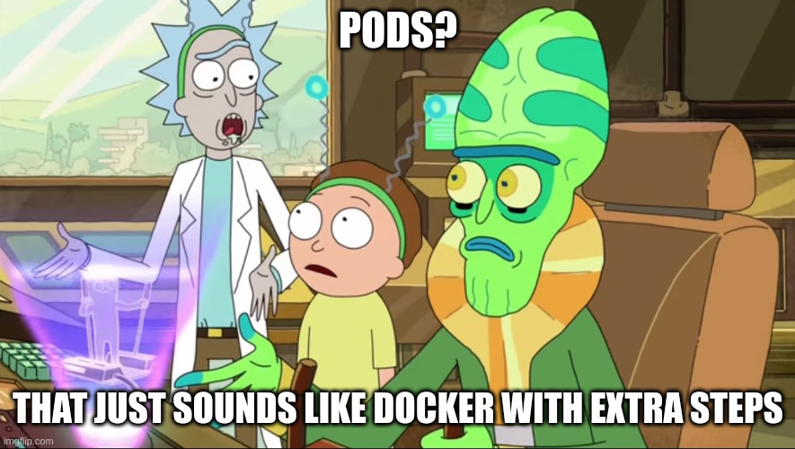

# From ZERO to CKAD
In dieser Blogserie wollen wir unseren Weg von Grundauf bis zum CKAD aufzeigen und möglichst viel aus dem Material
zur Vorbereitung zum CKAD anhand eines praktischen Beispiels erklären. Das Repository zum Mitmachen findet ihr 
.
Das erste Kapitel findet auf dem `main` Branch.

## Was ist Kubernetes?
Einfach gesagt: Kubernetes orchestriert Containerbasierte Anwendungen, um diese bei Bedarf automatisiert hoch und runter
fahren zu können. Um Kubernetes lokal verweneden zu können nutzen wir .

## Dockerized
Um unsere Applikation kubernetisieren zu können, müssen wir sie als erstes dockerisieren und ein Image daraus bauen,
mit dem wir dann weiter arbeiten.

Wir nutzen ein `node:16-alpine` Image, kopieren unseren Code hinein und installieren die npm Packages.
Beim Start des Containers lassen wir das Command zum starten des npm Servers laufen `CMD npm run start`.
Näheres zu Docker und wie man Dockerfiles schreibt bzw. eine React App dockerisiert könnt ihr 
[hier](https://blog.mayflower.de/13652-containerizing-django-react-docker.html) nachlesen.

Danach bauen wir das Image lokal mit `docker build -t frontend`. Damit wir lokale Images verwenden können, müssen wir 
minikube so einstellen, dass es die lokalen Images verwendet. Dazu lassen wir `minikube docker-env` laufen und anschließend 
`eval $(minikube -p minikube docker-env)`, damit diese von minikube lokal gesucht werden.

## Nodes
Nodes sind (virtuelle oder physikalische) Maschinen, auf denen ein oder mehrere Cluster laufen können. Jeder Node wird 
von einem Control Plane verwaltet und hat alle nötigen Resourcen, um Pods laufen zu lassen.

## Pods
Pods sind die kleinste deploybare Einheit im Kubernetes Universum. Ein Pod ist ähnlich einem Dockercontainer
mit dem Unterschied, dass er über Kubernetes gestartet wird. Um einen Pod für unsere App zu starten, brauchen
wir eine Beschreibung des Pods in einem Format, das Kubernetes versteht. Das kann entweder im `.yaml` oder `.json`
Format sein. Damit wir es besser lesen können, nutzen wir `.yaml`. Da wir den Boilerplate nicht selber schreiben
wollen, lassen wir uns das Skelett mit folgendem Befehl generieren:

```bash
kubectl run frontend --image=frontend:latest --dry-run=client -o yaml > pod.yaml
```

#### Was passiert hier?
Mit `kubectl run frontend` sagen wir Kubernetes, dass es einen Pod Namns *frontend* starten soll. Als Flag geben
wir noch das Image mit, welches benutzt werden soll. Das Flag `--dry-run=client` lässt Kubernetes das Command
durchlaufen, ohne den Pod tatsächlich zu starten. `-o yaml > pod.yaml` steht für Output im Format yaml und schreibt
uns diesen Output in die *pod.yaml*.
Supi, dann können wir die yaml nach unseren Bedürfnissen anpassen.

```yaml
apiVersion: v1
kind: Pod
metadata:
  labels:
    app: frontend
  name: frontend
spec:
  containers:
    - image: frontend:latest
      imagePullPolicy: Never
      name: frontend
      ports:
        - name: http
          containerPort: 8090
          protocol: TCP
  dnsPolicy: ClusterFirst
  restartPolicy: Always
```

Kubernetes versucht Images per default von der docker registry zu laden. Da wir unser Image bisher nur lokal gebaut
Das ganze müssen wir nochmal analog für unser Backend machen.

```yaml
apiVersion: v1
kind: Pod
metadata:
  labels:
    app: backend
  name: backend
spec:
  containers:
    - image: backend:latest
      imagePullPolicy: Never
      name: backend
      ports:
        - name: http
          containerPort: 8090
          protocol: TCP
  dnsPolicy: ClusterFirst
  restartPolicy: Always
```

Zeit, das Ganze mal laufen zu lassen: `k create -f pod.yaml` und testen auf *localhost:8090*.
Und natürlich ist das Ganze nicht erreichbar. Um den Pod ansprechen zu können müssen wir noch ein Port-Forwarding
machen, damit wir von unserem Browser den Container im Pod erreichen können. Dazu lassen wir 
`kubectl port-forward frontend 8090:8090` laufen, und schlupdiwup ist unsere App via *localhost:8090* erreichbar.



Geht da noch mehr? Lass es uns mit Deployments herausfinden!



