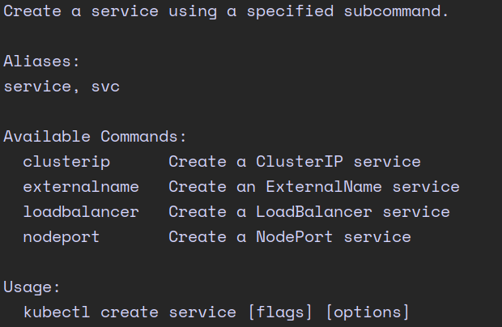
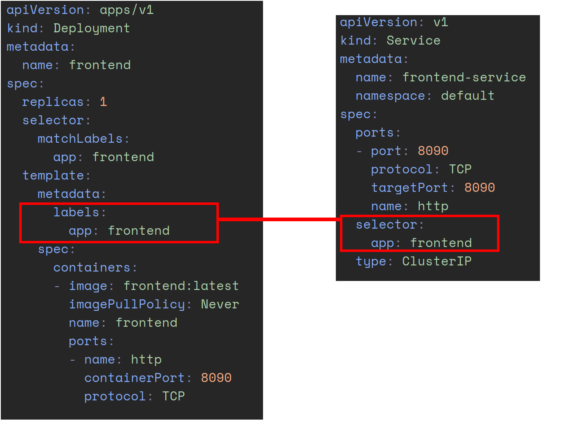
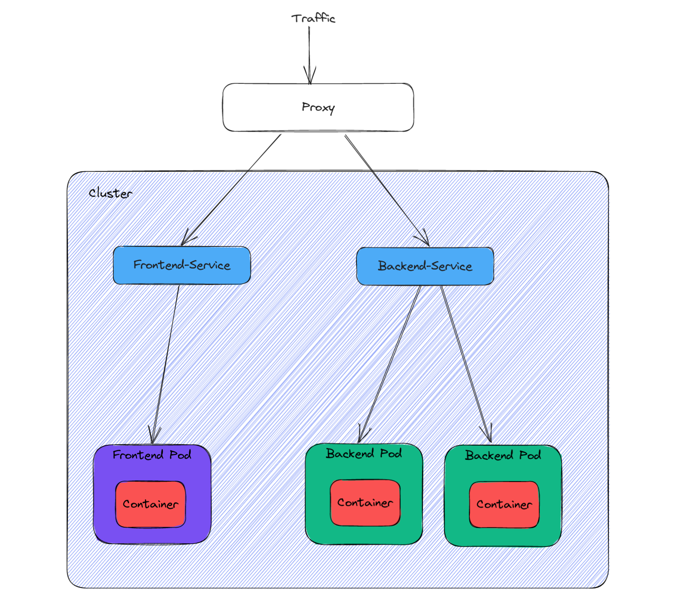

# From ZERO to CKAD
In dieser Blogserie wollen wir unseren Weg von Grundauf bis zum CKAD aufzeigen und möglichst viel aus dem Material
zur Vorbereitung zum CKAD anhand eines praktischen Beispiels erklären. Das Repository zum Mitmachen findet ihr 
. Die fertigen yamls für die Services findet ihr im Branch `services`.

## Was sind Services?
Ein Service in Kubernetes ermöglicht es, eine Gruppe von Pods (Container) als eine logische Einheit zu betrachten und 
ihnen eine stabile IP-Adresse zuzuweisen. Dadurch kann auf die Pods über den Service zugegriffen werden, unabhängig 
davon, welche Pods gerade laufen oder ausfallen. Der Service kann auch Load Balancing und Service Discovery-Funktionen 
bereitstellen.

## Wie erstellt man einen Service?
Wir stellen hier zwei Wege zum erstellen eines Services vor. Der erste ist, den Service selber zu konfigurieren, was für 
das erste mal hilfreich sein kann, um zu verstehen was einen Service ausmacht. Die alternative ist, das Deployment zu 
exposen und so den Service zu erstellen.

Um herauszufinden, wie wir den Service von Hand erstellen, holen wir uns Hilfe. `kubectl create service -h` zeigt uns 
welche Optionen wir haben um einen Service zu erstellen und zeigt uns Beispiele. 



So können wir uns weiter durch hangeln um dann letztenendes auf `k create service clusterip frontend 
--tcp=8090:8090 --dry-run=client -o yaml > service_frontend.k.yaml`. Wir geben dem Service mit dem Flag `--tcp=8090:8090`
ein Portmapping mit, welches vom Host zu den Pods mapped. 


Jetzt müssen wir es nur noch ein bisschen anpassen und schon haben wir den Service definiert.

```yaml
apiVersion: v1
kind: Service
metadata:
  name: frontend
  namespace: default
spec:
  ports:
  - port: 8090
    protocol: TCP
    targetPort: 8090
    name: http
  selector:
    app: frontend
  type: ClusterIP
```

Der andere Weg ist es, das Deployment zu exposen. Durch `kubectl expose deploy frontend` wird ein Service für das Deployment frontend anhand dessen
Konfiguration erstellt. Um das Manifest zu erhalten führt man `kubectl get svc frontend -o yaml > service.yaml` aus. 

Der Selector sucht anhand des Key-Value-Pairs passende Pods und leitet die Anfragen an die Pods mit passenden Labels weiter.


Der Type `ClusterIP` gibt an, dass die IP-Adresse innerhalb des Clusters genutzt werden kann. 
Es gibt sonst noch die folgenden Typen:

### NodePort 
NodePort ist eine Option, um externen Traffic in ein Kubernetes-Cluster zuzulassen. Dabei stehen jedoch nur Portnummern
im Bereich von 30000 bis 32767 zur Verfügung.

### LoadBalancer 
Der Loadbalancer erstellt einen ähnlichen Service wie ClusterIP und öffnet einen Port auf jeder Node, wie NodePort es tut. 
Letztenendes nutzt er die LoadBalancer implementierung des Cloud Providers, auf dem das Cluster deployed ist. 

### ExternalName
Der ExternalName erstellt einen einzigen Endpoint für jede Kommunikation zu dem Element. Falls diser Service ausgetauscht
werden muss, muss man nur den ExternalName anpassen, un nicht alle Connections.



Ok fein. Wir haben also einen Service, der für uns die Pods anspricht und wir müssen uns nicht mehr um die Zuweisungen
zur Erreichbarkeit der Pods kümmern, das erledigt ja der Service. Wir sind aber noch nicht ganz fertig. Wie können wir 
denn nun endlich die Applikation von außen erreichen?

